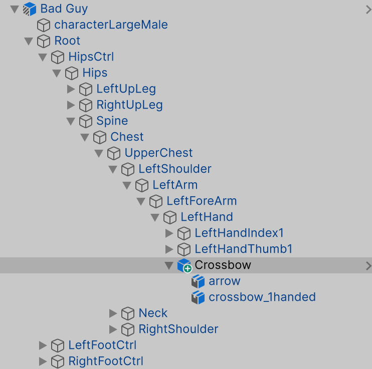
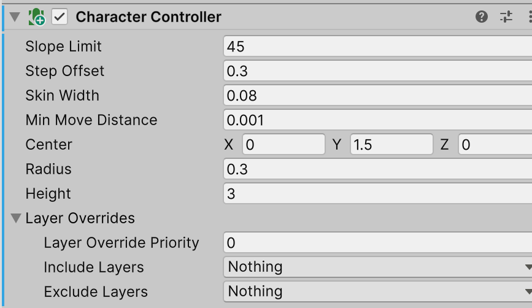
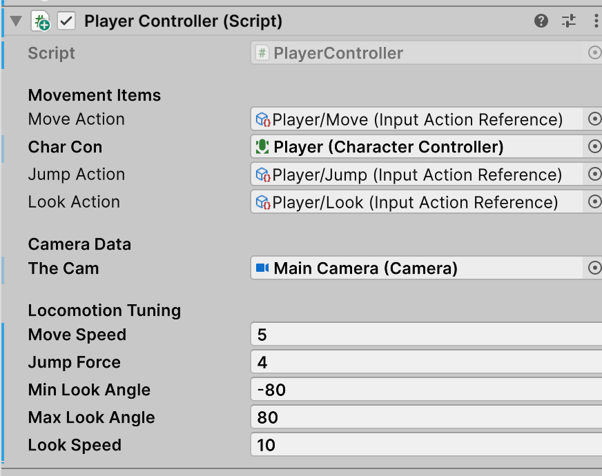
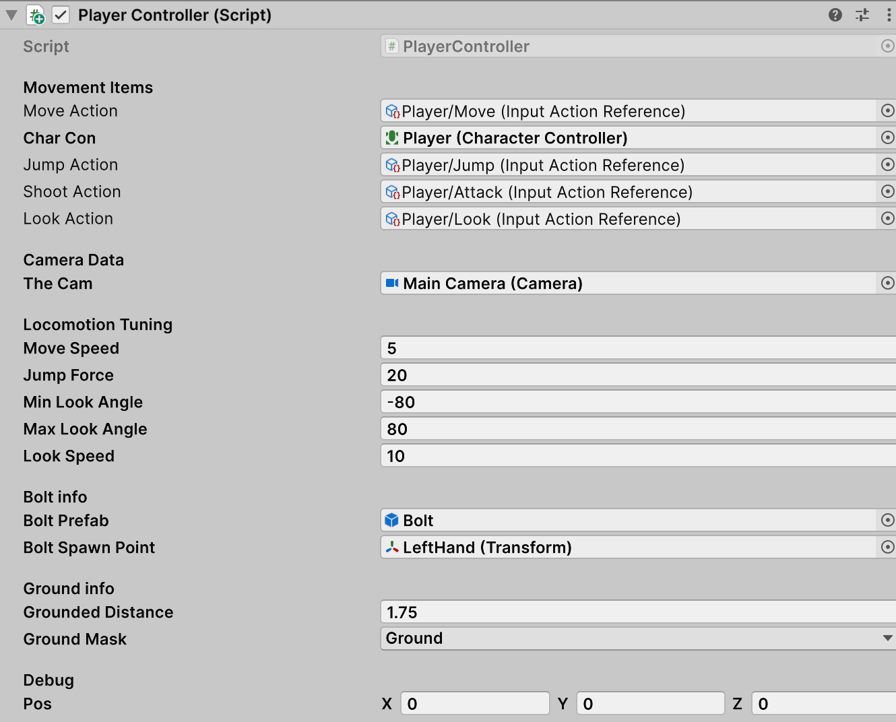
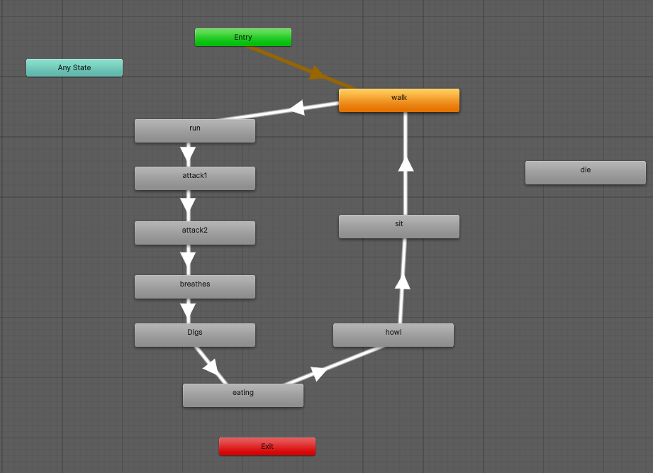
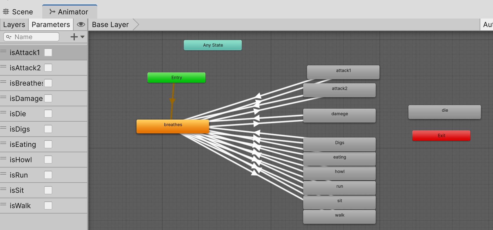
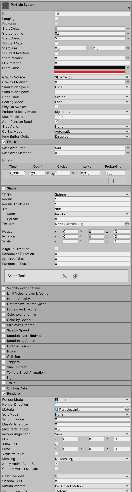
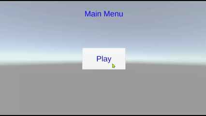

----

[TOC]

----

# Unity First Person Projectile
- link: 
- Author: 

## Unity, quick reminder of QWERTY tools:

| Command | Tool/Mode | Description |
| :--- | :--- | :--- |
| **Q** | Hand | For panning and navigating the Scene view. |
| **W** | Move | For translating (moving) objects along their X, Y, and Z axes. |
| **E** | Rotate | For rotating objects around their local or global axes. |
| **R** | Scale | For uniformly or non-uniformly scaling (stretching/resizing) objects. |
| **T** | Rect Transform | Primarily used for UI elements and 2D objects. |
| **Y** | Transform | A combination of the Move, Rotate, and Scale tools in a single gizmo. |

# Housekeeping
- I am using 6000.4.5f1 (Supported)
- Universal Render Pipeline is active
- In my notes, I  refer to panels as:

| &nbsp; Panel Name &nbsp; | &nbsp; Short Form &nbsp; | &nbsp; Description &nbsp; |
| :--- | :--- | :--- |
| &nbsp; Scene | &nbsp; **S** | &nbsp; Where you can drag objects and build 3D scene |
| &nbsp; Hierarchy | &nbsp; **H** | &nbsp;  See objects and their inheritance |
| &nbsp; Inspector | &nbsp; **I** | &nbsp; Detailed information on components for selected object &nbsp;|
| &nbsp; Project | &nbsp; **P** | &nbsp;  See resources relative to file directory |
| &nbsp; Game | &nbsp; **G** | &nbsp; Where the game is played |

# Setup
- create a 3D (URP) Core project
- Name: Animating Model Parts
- Remove the Readme Assets from URP

## add glTFast package
- open Package Manager
- \+ , Install package by technical name
    - com.unity.cloud.gltfast
    - Unity glTFast; 6.19.0 : May 19, 2026
- close package

## Materials
- rclick P, Assets; create folder Materials
- rclick P, Assets, Materials; create Material - name Red, Base Map: Red
- rclick P, Assets, Materials; create Material - name Green, Base Map: Green
- rclick P, Assets, Materials; create Material - name Blue, Base Map: Blue
- rclick P, Assets, Materials; create Material - name Yellow, Base Map: Yellow
- rclick P, Assets, Materials; create Material - name Cyan, Base Map: Cyan
- rclick P, Assets, Materials; create Material - name Magenta, Base Map: Magenta

## Models
- P, Assets; import package: Kenney_Toons_Animations_Tools.unitypackage
- (provide link to the project that builds this)
- create folder Models
- copy in:
<pre style="background-color: #1a1a1a; color: #ffffff; padding:15px; margin:5px">
    arrow.bin  
    arrow.glft 
    beholder.glb 
    crossbow_1handed.bin 
    crossbow_1handed.glft 
    rogue_texture.png
</pre>

## Create an environment
- H, Main Camera
    - Position: 0 3.5 10
    - Rotation: 0 180 0 
    - Scale: 1 1 1

- rclick H; create 3D-Cube, rename Ground
    - Position: 0 0 0
    - Rotation: 0 0 0 
    - Scale: 50 0.2 50
    - drag P, Assets, Materials, Yellow (or Green) onto Ground

# Build a Bad Guy

## Import the _kenney all package
- drag CriminalMaleLarge Male onto H; rename Bad Guy
    - add comp Capsule collider
    - Radius: 0.4
    - Center: 0 1.5 0
    - Height: 3.0
    - (note: need so we can "hit" the bad guy)

## Create a Weapon prefab
- create empty; rename Crossbow
- drag P, Models, arrow into H, Crossbow
- drag P, Models, crossbow_1Handed into H, Crossbow
- rclick P; create folder Prefabs
- drag H, Crossbow into P, Prefabs
- dclick P, Prefabs, Crossbow; click on Scene tab
- observe that arrow is position wrong
- H, Crossbow, arrow
    - Position: 0 .2 0.5
    - Rotation: 270 0 0 
    - Scale: 1 1 1
- return to SampleScene

## Merge Crossbow with Bad Guy
- drag weapon into LeftHand of Criminal
    - position: 0 0 0.001
    - rotation: 270 0 270
    - scale: 0.008 0.008 0.008

## Update animation; add bow shot
- dclick P, Assets, \_kenney, Animations, NPC
- observe open Animator tab
- Parameters, \+, isShooting
- drag P, Assets, \_kenney, Animations, Combat, BowShot onto Animator screne
- delete tpose
- rclick Idle, create transition, drag onto BowShot
- click transition
    - Conditions, \+; isShooting: true
- rclick BowShot, make transition to Idle
- open NPCController script
- add case:
<pre style="background-color: #1a1a1a; color: #ffffff; padding:15px; margin:5px">
            case AnimationState.BowShot:
                animator.SetBool("isShooting", true);
                break;
</pre>
- add to default:
<pre style="background-color: #1a1a1a; color: #ffffff; padding:15px; margin:5px">
            default:
                if (pickAxe) pickAxe.SetActive(false);
                if (basket) basket.SetActive(false);
                animator.SetBool("isMoving", false);
                animator.SetBool("isJumping", false);
                animator.SetBool("isMining", false); 
                animator.SetBool("isGathering", false);
                animator.SetBool("isShooting", false); // <-- here
                break;
</pre>
- save, unity
- H, BadGuy
    - Intial State: Bow Shot
- run; observe the Bad Guy shoot his crossbow
- (since the isShooting is never reset, a loop is created, that's ok for now)

# Build a Projectile

## Create a projectile script
- rclick P, Assets; create folder Scripts
- rclick P, Assets, Scripts; create MonoBehaviourScript; name RaycastProjectile:
<pre style="background-color: #1a1a1a; color: #ffffff; padding:15px; margin:5px">
 
    [SerializeField] private float speed = 50f;
    [SerializeField] private float gravity = 9.81f;
    [SerializeField] private LayerMask hitLayers;
    [SerializeField] private float maxLifetime = 60.0f;
    [SerializeField] private float hitLifetime = 10.0f;

    private Vector3 lastPosition;
    private Vector3 velocity;

    void Start()
    {
        lastPosition = transform.position;
        // Initial velocity in the direction the bolt is facing
        velocity = transform.forward * speed;
        Destroy(gameObject, maxLifetime);
    }

    void Update()
    {
        // 1. Calculate gravity/velocity over time
        velocity.y -= gravity * Time.deltaTime;

        // 2. Determine how far we would move this frame
        Vector3 step = velocity * Time.deltaTime;
        float stepMagnitude = step.magnitude;
        Vector3 stepDirection = velocity.normalized;

        // 3. Raycast from previous position to next intended position
        // This prevents "tunnelling" through thin walls at high speeds
        if (Physics.Raycast(lastPosition, stepDirection, out RaycastHit hit, stepMagnitude, hitLayers))
        {
            OnHit(hit);
        }
        else
        {
            // 4. If no hit, move the bolt and update lastPosition
            lastPosition = transform.position;
            transform.position += step;

            // Rotate bolt to face its current trajectory (weathervaning)
            if (velocity != Vector3.zero)
                transform.rotation = Quaternion.LookRotation(velocity);
        }
    }

    void OnHit(RaycastHit hit)
    {
        Destroy(gameObject,  hitLifetime);

        // Snap bolt to the hit point
        transform.position = hit.point;

        Debug.Log($"Hit {hit.collider.name}!");
        NPCController npc = hit.transform.GetComponent<NPCController>();
        if (npc != null)
        {
            npc.Hit();
        }

        // Example: Parent to the hit object so it sticks
        transform.SetParent(hit.transform);

        // Disable this script so it stops moving
        this.enabled = false;
    }
    private void OnDestroy()
    {
        
        Debug.Log($"Bolt {name} destroyed!");
    }
</pre>
- save unity

# Update Bad Guy 

## Add Death animation
- drag P, Assets, \_kenney, Animations, Combat, Death onto Animations
- delete tpose
- open NPCController
- add hps:
<pre style="background-color: #1a1a1a; color: #ffffff; padding:15px; margin:5px">
    public int hitPoints = 3;
</pre>
- add hit, with a default value of 1:
<pre style="background-color: #1a1a1a; color: #ffffff; padding:15px; margin:5px">
    public void Hit(int damage=1)
    {
        SetState(AnimationState.GetHit);
        hitPoints =- damage;
        if (hitPoints == 0)
        {
            animator.SetBool("isHit", false);
            animator.StopPlayback();
            animator.Play("Death");
        }
    }
</pre>
- note: feature, we could also add a force vector to knock back 
- save, unity

### create NPCDeath script behaviour
- select Animator, Death; Add Behaviour
- create script NPCDeath; (move this new script into P, Assets, Scripts)
- (note: a little Linq magic happening )
<pre style="background-color: #1a1a1a; color: #ffffff; padding:15px; margin:5px">

    override public void OnStateEnter(Animator animator, AnimatorStateInfo stateInfo, int layerIndex)
    {
        // 'animator.gameObject' refers to the object the Animator is attached to
        animator.GetComponent<Collider>().enabled = false;

        // get all the bolts and remove them.
        var bolts = animator.transform.Cast<Transform>()
            .Where(c => c.CompareTag("Bolt"))
            .Select(c => c.gameObject)
            .ToList();
        foreach (GameObject b in bolts) 
        {
            Destroy(b);
        }

        // remove the corpse, after 5 seconds
        Destroy(animator.gameObject,5f);     
    }
</pre>
- note: this will run when this state is entered

# Update Bolt 

## create a Bolt tag
- do this:
- tag should be: Bolt
<pre style="background-color: #1a1a1a; color: #ffffff; padding:15px; margin:5px">
Select any GameObject in your Hierarchy window.Go to the Inspector window. At the top, click the Tag dropdown menu (it usually says "Untagged").Select Add Tag... at the bottom of the list. This opens the Tags & Layers settings.Click the Plus (+) icon under the "Tags" list.Type the name for your new tag and click Save.
</pre>

## Add a hit animation
- add animation GetHit to the Animator
- in Animator, add isHit Parameter, initial value false [ ]
- set Idle to GetHit transition on Conditions isHit true
- set GetHit to Idle transition (no conditions)
- select GetHit
    - Add Behavior, name is: ResetIsHit
    - open ResetIsHit
<pre style="background-color: #1a1a1a; color: #ffffff; padding:15px; margin:5px">
    override public void OnStateExit(Animator animator, AnimatorStateInfo stateInfo, int layerIndex)
    {
        animator.SetBool("isHit", false);
    }
</pre>
- open NPCController script
- add:

<pre style="background-color: #1a1a1a; color: #ffffff; padding:15px; margin:5px">
            case AnimationState.GetHit: 
                animator.SetBool("isHit", true);
                break;
</pre>
- and a reset:
<pre style="background-color: #1a1a1a; color: #ffffff; padding:15px; margin:5px">

            default:
                if (pickAxe) pickAxe.SetActive(false);
                if (basket) basket.SetActive(false);
                animator.SetBool("isMoving", false);
                animator.SetBool("isJumping", false);
                animator.SetBool("isMining", false); 
                animator.SetBool("isGathering", false); 
                animator.SetBool("isHit", false); // <--- here
                break;
</pre>

# Create a Game Manager

## Add a GameManager
- rclick H; create empty; rename GameManager
    - add comp; GameManager; New Script
- open GameManager script, add this:
<pre style="background-color: #1a1a1a; color: #ffffff; padding:15px; margin:5px">
    void Start()
    {
        Cursor.lockState = CursorLockMode.Locked;
    }
</pre>

# Testing Projectile

## Add Projectile
- drag P, Assets, Models, arrow onto H
    - Position: 10, 3, .3  (so its pointed at the Bad Guy midsection)
    - observe its forward is down; this will mess up script
- note: we could change the script, but then we can re-use it
- note: we could edit the model of the arrow, but we would need different tools
- note: instead, lets wrap it in a empty object we can control
- rclick H; create empty; rename Bolt 
- drag bolt to be a child of arrow
    - Position: 0 0 0
- drag Bolt to be a child of H
    - Rotation: 0 270 0   (so its blue vector is pointed at the Bad Guy)
- drag arrow to be a child of Bolt
    - make sure arrow has position 0 90 -90 (relative to its parent)
- drag the P, Assets, Scripts, RaycastProjectile onto Bolt
- for now, set the Hit Layers to Everything
- create a Bolt prefab by dragging Bolt into P, Assets, Prefabs

## Have GameManager launch bolt
- rclick H; create empty; rename GameManager
    - add component Player Input
- open GameManager:

<pre style="background-color: #1a1a1a; color: #ffffff; padding:15px; margin:5px">
    [SerializeField] private GameObject boltPrefab;
    [SerializeField] private Transform boltSpawnPoint;
    private GameObject bolt = null;

    // Update is called once per frame
    void Update()
    {
        if (Keyboard.current.spaceKey.wasPressedThisFrame)
        {
            Debug.Log($"pressed space");

            if (bolt != null)
            {
                Debug.Log($"Bolt already spawned; cannot instantiate a new one yet"); 
            } else
            {
                bolt = Instantiate(boltPrefab, 
                         boltSpawnPoint.position, boltSpawnPoint.rotation);
                bolt.tag = "Bolt";
            }
        }
    }
</pre>

- save, unity
- from P, Assets, Prefabs; drag Bolt into the Bolt Prefab 
- rclick H; create empty; rename BoltSpawnPoint
    - Position 10 3 0
    - Rotation: 0 270 0
- note: this typically would be extracted from player weapons position
- drag prefab and BoltSpawnPoint into the script
- run, tap space, observe bolt hitting

# Add a Player
## Player Model
- drag in P, Assets, \_kenney, Prefabs, LargeFemale, SkaterFemaleLarge Variant; rename "Player"
    - Position 0 0 10
    - Rotation: 0 180 0
    - Scale: 1.8 1.8 1.8
    - remove NPC Controller Script
    - note: player should be looking at Bad Guy
- rclick H, Player; create empty, rename Camera Offset
    - Position: 0 2.75 1
    - Rotation: 0 0 0
    - Scale: 1 1 1
- drag H, Main Camera onto H, Player, Camera Offset
    - Position:  0 0 0
    - Rotation:  0 0 0
    - Scale:     1 1 1

## Add Control
- H, Player; add component Character Controller
    - Center: 0 1.5 0
    - Radius: 0.3

## PlayerController script
- rclick P, Assets, Scripts; create MonoBehaviour Script PlayerController
- drag P, Assets, Scripts, PlayerController onto Player
- open PlayerController
- add in 
<pre style="background-color: #1a1a1a; color: #ffffff; padding:15px; margin:5px">
    [Header("Movement Items")]
    [SerializeField] private InputActionReference moveAction;
    [SerializeField] private CharacterController charCon;
    [SerializeField] private InputActionReference jumpAction;
    [SerializeField] private InputActionReference lookAction;

    [Header("Camera Data")]
    [SerializeField] private Camera theCam;

    [Header("Locomotion Tuning")]
    [SerializeField] private float moveSpeed;
    [SerializeField] private float jumpForce;
    [SerializeField] private float minLookAngle;
    [SerializeField] private float maxLookAngle;
    [SerializeField] private float lookSpeed;

    private float ySpeed;
    private float horiRot;
    private float vertRot;
</pre>
- save, unity
- and set values:

- back to PlayerController script
- changes to Update to poll for movement

<pre style="background-color: #1a1a1a; color: #ffffff; padding:15px; margin:5px">
        Vector2 lookInput = lookAction.action.ReadValue<Vector2>();

        // left/right 
        horiRot += lookInput.x * Time.deltaTime * lookSpeed;
        transform.rotation = Quaternion.Euler(0f, horiRot, 0f);

        // up/down
        vertRot -= lookInput.y * Time.deltaTime * lookSpeed;
        vertRot = Mathf.Clamp(vertRot, minLookAngle, maxLookAngle);
        theCam.transform.localRotation = Quaternion.Euler(vertRot, 0f, 0f);

        Vector2 moveInput = moveAction.action.ReadValue<Vector2>();

        Vector3 vertMove = transform.forward * moveInput.y;
        Vector3 horiMove = transform.right * moveInput.x;

        Vector3 moveAmount = horiMove + vertMove;
        moveAmount = moveAmount.normalized;
        moveAmount = moveAmount * moveSpeed;

        if (charCon.isGrounded)
        {
            ySpeed = 0f;

            if (jumpAction.action.WasPressedThisFrame())
            {
                ySpeed = jumpForce;
            }
        }

        ySpeed = ySpeed + (Physics.gravity.y * Time.deltaTime);

        moveAmount.y = ySpeed;
        charCon.Move(moveAmount * Time.deltaTime);

</pre>
- save, unity, test run. 

# UI Canvas

## Adding a dot
- rclick H, create UI canvas- Canvas; rename UI Canvas
//- the system automatically brings in an EventSystem. For now, make it a child of UI Canvas.
    - UI Scale Mode: Scale with Screen Size.
    - Reference Resolution: 1920 1080
- dclick H, UI Canvas (to focus on it)
- 2D mode
- UI Canvas, Add UI Image, rename Center Dot
    - Width: 5 Height 5
- save, run
- observe a little white dot that tells us where we are looking

## Add player animation
- add animator
<pre style="background-color: #1a1a1a; color: #ffffff; padding:15px; margin:5px">
    [Header("Misc")]
    [SerializeField] private Animator animator;
</pre>
- check for and animate movement
<pre style="background-color: #1a1a1a; color: #ffffff; padding:15px; margin:5px">
        // check before adding gravity
        if (moveAmount.magnitude > 0.1f)
        {
            animator.SetBool("isMoving", true);
        }
        else
        {
            animator.SetBool("isMoving", false);
        }

        // add gravity
        moveAmount.y = ySpeed;

        // move character
        charCon.Move(moveAmount * Time.deltaTime);
    }
</pre>
- save, unity
- assign Animator to script

## Optional: Use Raytracing to fix jump
- note: sometimes there are problems with jump detection 
- use raycast instead
- create Layer called "Ground"
- assign Layer Ground to H, Ground
- add code :
<pre style="background-color: #1a1a1a; color: #ffffff; padding:15px; margin:5px">

   [Header("Ground info")]
   [SerializeField] private float groundedDistance = 1.5f;
   [SerializeField] LayerMask groundMask;
...

        // move character
        charCon.Move(moveAmount * Time.deltaTime);
        pos = transform.position;

        bool isGrounded = IsGrounded();

        // add jump velocity is applicable
        if (charCon.isGrounded)
        {
            //Debug.Log($"grounded?");
            ySpeed = 0f;

            if (jumpAction.action.WasPressedThisFrame())
            {
                //Debug.Log($"jumping?");
                ySpeed = jumpForce;
            }
        }
...

    bool IsGrounded()
    {
        return Physics.Raycast(transform.position, 
               Vector3.down, groundedDistance, groundMask);
    }
</pre>
- assign 

# Add Weapon to Player
- drag P, Assets, Prefabs, Crossbow into Player:
<pre style="background-color: #1a1a1a; color: #ffffff; padding:15px; margin:5px">
Player 
    characterLargeFemale 
    Root 
        HipsCtrl 
        Hips 
        LeftUpLeg 
        RightUpLeg 
        Spine 
            Chest 
                UpperChest 
                    LeftShoulder 
                        LeftArm 
                            LeftForeArm 
                                LeftHand 
                                    LeftHandIndex1 
                                    LeftHandThumb1 
                                    Crossbow  // <--- here
                    RightShoulder 
</pre>
- set Crossbow Transform:
    - Position : 0 0 0.001
    - Rotation : 270 0 270
    - Scale : 0.008 0.008 0.008

# Allow Player to fire Weapon
- open PlayerController script
<pre style="background-color: #1a1a1a; color: #ffffff; padding:15px; margin:5px">
    [Header("Weapon info")]
    [SerializeField] private GameObject boltPrefab;
    [SerializeField] private Transform boltSpawnPoint;
    [SerializeField] private InputActionReference attack;
    private GameObject bolt = null;
</pre>
- save, unity
- assign script items
    - drag P, Assets, Prefabs, Bolt into Bolt Prefab
    - drag H, Player, ..., Crossbow into Bolt Spawn Point // <- need this?
    - assign Attack: Player/Attack
- open PlayerController script, add to update:
<pre style="background-color: #1a1a1a; color: #ffffff; padding:15px; margin:5px">

        if (attack.action.WasPressedThisFrame())
        {
            bolt = Instantiate(boltPrefab, theCam.transform.position,
                              theCam.transform.rotation);
            bolt.tag = "Bolt";
        }
</pre>
- save, unity
- open GameManager script, remove the test code for bolt:
<pre style="background-color: #1a1a1a; color: #ffffff; padding:15px; margin:5px">
using UnityEngine;

public class GameManager : MonoBehaviour
{
    void Start()
    {
        Cursor.lockState = CursorLockMode.Locked;
    }
}
</pre>

# Add firing animation to player
- open PlayerController script
<pre style="background-color: #1a1a1a; color: #ffffff; padding:15px; margin:5px">
        if (attack.action.WasPressedThisFrame())
        {
            animator.Play("BowShot");   // <-- here
            bolt = Instantiate(boltPrefab, theCam.transform.position,
                               theCam.transform.rotation);
            bolt.tag = "Bolt";
        }
</pre>

# Ammo bundle
## Ammo Bundle Prefab
- rclick H; create empty; rename "AmmoBundle"
- rclick H, AmmoBundle; drag P, Assets, Prefabs, Bolt onto it
    - rename Bolt Bolt(0)
    - duplicate 7 times, rename: Bolt(0)...Bolt(7)
- drag H, AmmoBundle into  P, Assets, Prefabs
- dclick P, Assets, Prefabs, AmmoBundle
- H, AmmoBundle, select all the Bolts
    - Position: 0 0 0
    - 270 0 0
    - 1 1 1
    - remove the script

- Adjust the individual positions to create a bundle:
<pre style="background-color: #1a1a1a; color: #ffffff; padding:15px; margin:5px">

 0     0  0
 0     0  0.05
 0     0 -0.05
 0.05  0 -0.05
 -0.05 0 -0.05
 0.05  0  0.05
 -0.05 0  0.05
 0.05  0  0
 -0.05 0  0
</pre>
- H, AmmoBundle
    - add component; Box Collider
    - Center: 0.01 0.01 -0.01
    - Size: 0.2 .75 0.2
    - create a Layer, Ammo
    - Layer: Bundle  (this object only)

## Add some ammo bundles
- delete H, AmmoBundle
- drag P, Assets, Prefabs, AmmoBundle onto H
    - Position: 0 1 4
    - Rotation: 0 0 0
    - Scale: 2 2 2
- set the Scene back to SampleScene

# Pickup ammo, add ammo count
- create Tag called Ammo
- H, AmmoBundle; Tag: Ammo
- open PlayerController script
<pre style="background-color: #1a1a1a; color: #ffffff; padding:15px; margin:5px">
    private void OnTriggerEnter(Collider other)
    {
        // Check if the object we collided with is tagged as "Ammo"
        if (other.CompareTag("Ammo"))
        {
            Debug.Log("Collected Ammo Bundle!");
            Destroy(other.gameObject);
        }
    }
</pre>

# Add ammo count
- open PlayerController script
- add accessors
<pre style="background-color: #1a1a1a; color: #ffffff; padding:15px; margin:5px">
    [Header("Ammo info")]
    [SerializeField] private int maxAmmo = 10;
    [SerializeField] private int ammoCnt = 0;
</pre>
- modify OnTriggerEnter
<pre style="background-color: #1a1a1a; color: #ffffff; padding:15px; margin:5px">
        // Check if the object we collided with is tagged as "Ammo"
        if (other.CompareTag("Ammo"))
        {
            ammoCnt += 8;
            if (ammoCnt > maxAmmo) ammoCnt = maxAmmo;

            // Destroy the ammo bundle from the scene
            Destroy(other.gameObject);
</pre>
- modify attack logic in Update
<pre style="background-color: #1a1a1a; color: #ffffff; padding:15px; margin:5px">
        if (attack.action.WasPressedThisFrame() && ammoCnt>0) // <-- here
        {
            ammoCnt--; // <-- here
            animator.Play("BowShot"); 
            bolt = Instantiate(boltPrefab, theCam.transform.position,
                              theCam.transform.rotation);
            bolt.tag = "Bolt";
        }
</pre>
- save, unity
- dupe AmmoBundle a few times, move them around the play field
- run. run over two ammo bundles; note that your ammo count is 10

# Display ammo count; display kill count
- dclick H, UI Canvas
- go into 2D mode
- rclick H, UI Canvas; create UI (Canvas) - Panel
- rclick H, UI Canvas, Panel; create Text Mesh Pro Text, rename ScoreText
    - triggers TMP Importer, click Import TMP Essentials and close
    - Position: -850 500 0
    - Color: Alpha: 0
    - Alignment: Right/Center
    - Font Size: 36
    - Vertex Color: FFFFFF  (white)
    - Text: Score:
- H, UI Canvas, Panel, ScoreText; dupe; rename Score
    - Position: -640 500 0
    - Text: 9999
    - Alignment: Left/Center
- H, UI Canvas, Panel, ScoreText; dupe; rename AmmoText
    - Position: 640 500 0
    - Text: Ammo:
- H, UI Canvas, Panel, Score; dupe; rename Ammo
    - Position: 850 500 0
    - Text: 99
- rclick P, Assets, Scripts; create MonoBehaviour Script: UICanvasController
- open UICanvasController; singleton
<pre style="background-color: #1a1a1a; color: #ffffff; padding:15px; margin:5px">
using TMPro;
using UnityEngine;

public class UICanvasController : MonoBehaviour
{
{
    [Header("Movement Items")]
    [SerializeField] private TextMeshProUGUI scoreValue;
    [SerializeField] private TextMeshProUGUI ammoValue;

    private int ammoAmount;
    private int scoreAmount;

    public static UICanvasController instance;

    private void Awake()
    {
        if (instance == null)
        {
            instance = this;
        }
    }
    void Start()
    {
        scoreValue.text = "0";
        ammoValue.text = "0";
    }
    private void Update()
    {
        scoreValue.text = ammoAmount.ToString();
        ammoValue.text = ammoAmount.ToString();
    }
    public void SetScoreValue(int value)
    {
        scoreAmount += value;
    }

    public void SetAmmoValue(int value)
    {
        ammoAmount = value;
    }
}
</pre>
- save, unity
- assign script variables

# Add ammo update logic
- open PlayerController script
- accessors
<pre style="background-color: #1a1a1a; color: #ffffff; padding:15px; margin:5px">
    [SerializeField] private UICanvasController ui = UICanvasController.instance;
</pre>
- update changes
<pre style="background-color: #1a1a1a; color: #ffffff; padding:15px; margin:5px">
    void Update()
    {
        ui = UICanvasController.instance;   // <--- here
...
</pre>
- ammo count updates
<pre style="background-color: #1a1a1a; color: #ffffff; padding:15px; margin:5px">
        if (attack.action.WasPressedThisFrame() && ammoCnt>0)
        {
            ammoCnt--;
            ui.SetAmmoValue(ammoCnt);   // <--- here
            animator.Play("BowShot"); 
            bolt = Instantiate(boltPrefab, theCam.transform.position,
                   theCam.transform.rotation);
            bolt.tag = "Bolt";
        }
</pre>

# Add score update logic
- open NPCController script
- add accessor
<pre style="background-color: #1a1a1a; color: #ffffff; padding:15px; margin:5px">
    public void Hit(int damage=1)
    {
        SetState(AnimationState.GetHit);
        hitPoints = hitPoints - damage;
        if (hitPoints <= 0)
        {
            animator.SetBool("isHit", false);
            animator.StopPlayback();
            animator.Play("Death");
            UICanvasController.instance.SetScoreValue(1); // <-- here
        }
    }
</pre>

# Get some polygons for variety
- one comes with trees and such
<pre style="background-color: #1a1a1a; color: #ffffff; padding:15px; margin:5px">
Low Poly Nature collection 1.1 . February 20, 2019
</pre>
- another with a wolf
<pre style="background-color: #1a1a1a; color: #ffffff; padding:15px; margin:5px">
Wolf Animated 1.0 . September 06, 2015
</pre>
- grab a werewolf from sketchfab
- note that we need fix rendering pipeline
- Edit-Rendering-Materials-Convert All Built In Materials to Current SRP

# More animations, using mixamo
## import model
- you will need an account
- upload (any) \_kenney model (they all use similar rigging)
- find animation (I chose Farming, 25 animations)
- download, set FPS to 60
- extract downloaded files
- in unity, P, Assets; create folder \_mixamo\_farming\_pack
- drag expanded animations
- select all the animations
    - Rig; Animation Type : Humanoid

## Integrate into existing NPC animator
- H, Bad Guy; Animator tab
    - drag P, Assets, \_mixamo\_farming\_pack, plant tree 
    - rename PlantTree
    - add Parameter isPlantingTree
    - create transitions from Idle to PlantTree
- open NPC script
- add logic for transitioning to and from PlantTree
- add AnimationState: PlantingTree    
- save, unity
- H, Bad Guy
    - Initial State: Planting Tree

## Remove the tool
- tool for an animation (typically) should be visible when in use
-  H, Bad Guy, ... Crossbow
   - add a Tool empty object to LeftHand
   - move Crossbow into this Tool
   - set Crossbow inactive
- note: this gives us a generic Tool we can toggle the children of

- Animator Tab
    - add Behaviour BowShot to BowShot
<pre style="background-color: #1a1a1a; color: #ffffff; padding:15px; margin:5px">
    public GameObject model;
...
    override public void OnStateEnter(Animator animator, AnimatorStateInfo stateInfo, int layerIndex)
    {
        if (model != null)
        {
            foreach (Transform child in model.transform)
            {
                child.gameObject.SetActive(true);
            }
        }
    }
...
    override public void OnStateExit(Animator animator, AnimatorStateInfo stateInfo, int layerIndex)
    {
        if (model != null)
        {
            foreach (Transform child in model.transform)
            {
                child.gameObject.SetActive(false);
            }
        }
    }

</pre>
- note: I think I can simplify this?
- open NPCController
- modify Start
- note: find the Tool we added, assign to to Behaviour
<pre style="background-color: #1a1a1a; color: #ffffff; padding:15px; margin:5px">
    {

        var target = GetComponentsInChildren<Transform>(true)
                   .FirstOrDefault(t => t.name == "Tool")?.gameObject;

        animator.GetBehaviour<BowShot>().model = target;

...
    }
</pre>
- save, unity
- set initial state of bad guy to plant tree; run, loops, no crossbow
- set initial state of bad guy to bow shot; run, loops, crossbow

# Create Werewolf
- rclick P, Assets; create folder: \_sketchfab\_werewolf
- drag from file system, source, textures into P, Assets, \_sketchfab\_werewolf
- click P, Assets, \_sketchfab\_werewolf, source, werewolf
    - Rig tab; Animation Type: Humanoid; Apply
- drag P, Assets, \_sketchfab\_werewolf, source, werewolf into H
    - rename Werewolf
    - Position: 5 0.1 0
    - Rotation: 0 0 0
    - Scale:    6 6 6
    - Controller: NPC
    - add comp: NPC Controller
        - drag in Animator 
        - Initial State: Planting Tree
    - add comp: Capsule Collider
        - Center; X: 0 Y: 0.5 Z: 0
        - Radius: 0.2
        - Height: 1.2
 
- drag H, Werewolf into P, Assets, Prefabs

# Create Wolf Prefab
- rclick P, Assets; create folder \_Wolf\_Animated
- from Package, my unity assets, import
<pre style="background-color: #1a1a1a; color: #ffffff; padding:15px; margin:5px">
    Material 
    Model 
    Prefabs 
    Scene 
    Textures
</pre>
- rclick P, Assets, \_Wolf\_Animated, Model; create Animation-Animation Controller
    - rename Wolf\_animation
- drag P, Assets, \_Wolf\_Animated, prefabs, Wolf into H
    - Position: -5 .1 0
    - Rotation: 0 0 0
    - Scale: 1 1 1
    - Controller: Wolf\_animation
    - add comp: Box Collider
        - Center; X: 0 Y: 1.5 Z: 0
        - Size; X: 1 Y: 1 Z: 3

- open animator tab
- drag P, Assets, \_Wolf\_Animated, Model, *, into Animator 
<pre style="background-color: #1a1a1a; color: #ffffff; padding:15px; margin:5px">
    Wolf_attack1 
    Wolf_attack2 
    Wolf_breathes 
    Wolf_damege 
    Wolf_die 
    Wolf_Digs 
    Wolf_eating 
    Wolf_howl 
    Wolf_run 
    Wolf_sit 
    Wolf_walk
</pre>
- note: we will need to create a WolfController, similar to NPCController
- note: however, to view the animations, create this:

- drag Wolf into P, Assets, Prefabs; create a Variant

# Add gravity to NPCController

# Add A Terrain
- drag P, Assets, ..., Terrain\_1 onto H
    - Position: 0 -9.5 0
    - Rotation: 0 0 0
    - Scale: 1 1 1
- remove H, Ground
- adjust H, Bad Guy
    - Position: 0 -3.2 0
- adjust H, Wolf
    - Position: -5 -2.97 0
- adjust H, Werewolf
    - Position: 5 -2.64 0
    - add comp: Capsule Collider
        - Center: 0 0.5 0
        - Radius: 0.2
        - Height: 1
- adjust AmmoBundle
    - Position: 20 4.65 1.5
    - remove Box Collider
    - add comp: Sphere Collider; Radius: 2

# Create controller for wolf
- note: for now we want to add HP and playing death animation
- create an initial WolfController script

<pre style="background-color: #1a1a1a; color: #ffffff; padding:15px; margin:5px">
public class WolfController : MonoBehaviour
{
    Dictionary<WolfAnimationState, string> behaviors =  new()
    {
        {WolfAnimationState.Attack1,  "isAttack1"  },
        {WolfAnimationState.Attack2,  "isAttack2"  },
        {WolfAnimationState.Breathes, "isBreathes" },
        {WolfAnimationState.Damage,   "isDamage"   },
        {WolfAnimationState.Die,      "isDie"      },
        {WolfAnimationState.Digs,     "isDigs"     },
        {WolfAnimationState.Eating,   "isEating"   },
        {WolfAnimationState.Howl,     "isHowl"     },
        {WolfAnimationState.Run,      "isRun"      },
        {WolfAnimationState.Sit,      "isSit"      },
        {WolfAnimationState.Walk,     "isWalk"     }
    };

    public Animator animator;
    public WolfAnimationState initialState = WolfAnimationState.Sit;
    private WolfAnimationState currentState;

    // Start is called once before the first execution of Update after the MonoBehaviour is created
    void Start()
    {
        currentState = initialState;
        SetState(initialState);
    }

    // Update is called once per frame
    void Update()
    {

    }
    public void SetState(WolfAnimationState state)
    {
        if (animator == null) return;

        animator.SetBool(behaviors[currentState], false);
        animator.SetBool(behaviors[state], true);
        currentState = state;
    }
}
public enum WolfAnimationState
{
    Attack1,
    Attack2,
    Breathes,
    Damage,
    Die,
    Digs,
    Eating,
    Howl,
    Run,
    Sit,
    Walk
}

</pre>
- save, unity
## Setup Animator 
- assign Animator to script
- Animator tab
- add parameters
- choose breathes as base state
- add transitions ; true to state, false to return to breathe state
- don't do die; no point

## Create a WolfDie
- we will need a "WolfDie" behavior; select die, click Behavior
<pre style="background-color: #1a1a1a; color: #ffffff; padding:15px; margin:5px">
    override public void OnStateEnter(Animator animator, AnimatorStateInfo stateInfo, int layerIndex)
    {
        // 'animator.gameObject' refers to the object the Animator is attached to
        animator.GetComponent<Collider>().enabled = false;

        // get all the bolts and remove them.
        var bolts = animator.transform.Cast<Transform>()
            .Where(c => c.CompareTag("Bolt"))
            .Select(c => c.gameObject)
            .ToList();
        foreach (GameObject b in bolts)
        {
            Destroy(b);
        }

        // remove the corpse, after 5 seconds
        Destroy(animator.gameObject, 5f);
    }
</pre>
- adjust RaycastProjectile to allow it to hit Wolfs
<pre style="background-color: #1a1a1a; color: #ffffff; padding:15px; margin:5px">

        WolfController wolf = hit.transform.GetComponent<WolfController>();
        if (wolf != null)
        {
            wolf.Hit();
        }
</pre>
## WolfController script
- code
<pre style="background-color: #1a1a1a; color: #ffffff; padding:15px; margin:5px">
using System.Collections.Generic;
using UnityEngine;

public class WolfController : MonoBehaviour
{

    public int hitPoints = 3;

    Dictionary<WolfAnimationState, string> behaviors =  new()
    {
        {WolfAnimationState.Attack1,  "isAttack1"  },
        {WolfAnimationState.Attack2,  "isAttack2"  },
        {WolfAnimationState.Breathes, "isBreathes" },
        {WolfAnimationState.Damage,   "isDamage"   },
        {WolfAnimationState.Die,      "isDie"      },
        {WolfAnimationState.Digs,     "isDigs"     },
        {WolfAnimationState.Eating,   "isEating"   },
        {WolfAnimationState.Howl,     "isHowl"     },
        {WolfAnimationState.Run,      "isRun"      },
        {WolfAnimationState.Sit,      "isSit"      },
        {WolfAnimationState.Walk,     "isWalk"     }
    };

    public Animator animator;
    public WolfAnimationState initialState = WolfAnimationState.Sit;
    private WolfAnimationState currentState;

    // Start is called once before the first execution of Update after the MonoBehaviour is created
    void Start()
    {
        currentState = initialState;
        SetState(initialState);
    }

    // Update is called once per frame
    void Update()
    {

    }
    public void SetState(WolfAnimationState state)
    {
        if (animator == null) return;

        animator.SetBool(behaviors[currentState], false);
        animator.SetBool(behaviors[state], true);
        currentState = state;
    }
    public void Hit(int damage = 1)
    {
        SetState(WolfAnimationState.Damage);
        hitPoints = hitPoints - damage;
        if (hitPoints <= 0)
        {
            //Debug.Log($"NPCController:: Hit dead: {hitPoints}");
            animator.SetBool(behaviors[WolfAnimationState.Damage], false);
            animator.StopPlayback();
            animator.Play("die");
            UICanvasController.instance.SetScoreValue(1);
        }
    }
}
public enum WolfAnimationState
{
    Attack1,
    Attack2,
    Breathes,
    Damage,
    Die,
    Digs,
    Eating,
    Howl,
    Run,
    Sit,
    Walk
}

</pre>

## BUG fix
- noticed that the animations were moving the werewolf and bad man
- H, Werewolf
    - Apply Root Motion: [ ] (uncheck it)
- H, Bad Man
    - Apply Root Motion: [ ] (uncheck it)

# Game Manager to spawn bad guys
## Bad Guy Spawn
- drag Bad Guy into P, Assets, Prefabs; create a Variant
- rclick H; create empty; rename BadGuySpawnPoint
- drag BadGuySpawnPoint into Bad Guy
    - Position: 0 0 0
    - Rotation: 0 0 0
    - Scale: 1 1 1
- drag BadGuySpawnPoint into H
- H, Game Manager ; assign script variables
    - Ui: UI Canvas (UI Canvas Controller)  
    - Bad Guy Prefab: Bad Guy Variant 
    - Bad Guy Spawn Point: BadGuySpawnPoint (Transform)
- delete H, Bad Guy
## Werewolf Spawn
- note: there should already be a Werewolf prefab
- rclick H; create empty; rename WereWolfSpawnPoint
- drag WereWolfSpawnPoint into H, WereWolf
    - Position: 0 0 0
    - Rotation: 0 0 0
    - Scale: 1 1 1
- drag WereWolfSpawnPoint into H
- H, Game Manager ; assign script variables
    - Were Wolf Prefab: Werewolf 
    - Were Wolf Spawn Point: WereWolfSpawnPoint (Transform)
- delete H, WereWolf
## Wolf Spawn
- note: there should already be a Wolf prefab
- rclick H; create empty; rename WolfSpawnPoint
- drag WolfSpawnPoint into Wolf
    - Position: 0 0 0
    - Rotation: 0 0 0
    - Scale: 1 1 1
- drag WolfSpawnPoint into H
- H, Game Manager ; assign script variables
    - Wolf Prefab: Wolf Variant 
    - Were Wolf Spawn Point: WolfSpawnPoint (Transform)
- delete H, Wolf
## GameManager Script 
- modify GameManager Script
- note: we should consider EnemyManager script instead? hmm.
<pre style="background-color: #1a1a1a; color: #ffffff; padding:15px; margin:5px">
    [Header("BadGuy info")]
    [SerializeField] private GameObject badGuyPrefab;
    [SerializeField] private Transform badGuySpawnPoint;
    
    [Header("WereWolf info")]
    [SerializeField] private GameObject wereWolfPrefab;
    [SerializeField] private Transform wereWolfSpawnPoint;

    [Header("Wolf info")]
    [SerializeField] private GameObject wolfPrefab;
    [SerializeField] private Transform wolfSpawnPoint;

    void Start()
    {
        Cursor.lockState = CursorLockMode.Locked;
        SpawnBadGuy();
        SpawnWereWolf();
        SpawnWolf();
    }
    private void SpawnBadGuy()
    {
       _ = Instantiate(badGuyPrefab, badGuySpawnPoint.position,
                       badGuySpawnPoint.rotation);
    }
    private void SpawnWereWolf()
    {
       _ = Instantiate(wereWolfPrefab, wereWolfSpawnPoint.position,
                       wereWolfSpawnPoint.rotation);
    }
    private void SpawnWolf()
    {
       _ = Instantiate(wolfPrefab, wolfSpawnPoint.position,
                       wolfSpawnPoint.rotation);
    }
</pre>
  
# ReSpawn

# Werewolf Animation 
## Create a Particle System
- rclick H; Effects > Particle System; rename Blood Cloud
- configure as:

- drag into P, Assets, Prefabs
- delete Blood Cloud
## add in particle
- open GameManager
<pre style="background-color: #1a1a1a; color: #ffffff; padding:15px; margin:5px">
...
    [Header("Blood Cloud info")]
    [SerializeField] private GameObject cloudPrefab;
    [SerializeField] private float effectDuration = 1.5f;

    void Start()
    {
        Cursor.lockState = CursorLockMode.Locked;
        SpawnBadGuy();
        StartCoroutine(SummonWereWolf());
        StartCoroutine(SummonWolf());
    }
    private void SpawnBadGuy()
    {
        _ = Instantiate(badGuyPrefab, badGuySpawnPoint.position,
            badGuySpawnPoint.rotation);
    }
    IEnumerator SummonWereWolf()
    {
        GameObject temp = Instantiate(badGuyPrefab, wereWolfSpawnPoint.position,
                                      wereWolfSpawnPoint.rotation); 
        GameObject spawnedCloud = Instantiate(cloudPrefab,
                      wereWolfSpawnPoint.position, wereWolfSpawnPoint.rotation); 

        yield return new WaitForSeconds(effectDuration - 0.2f);

        _ = Instantiate(wereWolfPrefab, wereWolfSpawnPoint.position,
                        wereWolfSpawnPoint.rotation);
        Destroy(temp);
    }

    IEnumerator SummonWolf()
    {
        GameObject temp = Instantiate(badGuyPrefab, wolfSpawnPoint.position,
                          wolfSpawnPoint.rotation); 
        GameObject spawnedCloud = Instantiate(cloudPrefab, wolfSpawnPoint.position,
                                  wolfSpawnPoint.rotation); 

        yield return new WaitForSeconds(effectDuration - 0.2f);

        _ = Instantiate(wolfPrefab, wolfSpawnPoint.position,
            wolfSpawnPoint.rotation);

        Destroy(temp);
    }
</pre>
- save, update GameManager script params

# Add a Main Menu
## Build UI
- P, Assets, Scenes; rename SampleScene to Game
- rclick P, Assets, Scenes; create Scene-Scene; rename Main
- dclick P, Assets, Scene, Main
- rclick H; UI(Canvas) - Canvas
- rclick H, Canvas; create UI(Canvas) - Panel
- rclick H, Canvas, Panel; create UI(Canvas) - Text; rename Title
    - Pos X:0, Pos Y: -125, Pos Z:0
    - Width: 1000 Height: 100
    - top center
    - Text: Main Menu
    - Auto Size [x]
    - Vertex Color: 0000FF  (blue)
- rclick H, Canvas, Panel; create UI(Canvas) - Button; rename Play
    - Pos X:0, Pos Y: 0, Pos Z:0
    - Width: 400 Height: 200
    - middle center
- H, Canvas, Panel, Play, Text
    - Text: Play
    - Auto Size [x]
    - Vertex Color: 0000FF  (blue)
## Add Manager Script
- rclick H; create empty; rename MainManager
    - add comp: New SCript: MainManger
<pre style="background-color: #1a1a1a; color: #ffffff; padding:15px; margin:5px">
using UnityEngine;
using UnityEngine.SceneManagement;

public class MainManager : MonoBehaviour
{

    public void LoadGame()
    {
        SceneManager.LoadScene("Game");
    }
}
</pre>
- save, unity
- H, Canvas, Panel, Play
    - On Click; \+
    - Runtime Only; MainManager; MainManager.LoadGame
- run, press Play; game should launch

## Fix positioning bug
- player rotates to 0 0 0 position
- not a bug, expected
- Scene: Game
- H, Player
    - Position: 0 -3 -15
    - Rotation: 0 0 0

# Add VR Player
## Add XR Plug-In Management
- Edit - Project Settings - XR Plugin Management; Install XR Plugin Management
- Wait
- XR Plugin Management
     - [X] OpenXR
- XR Plugin Management, OpenXR; \+ add Enabled Interaction Profiles
<pre style="background-color: #1a1a1a; color: #ffffff; padding:15px; margin:5px">
     Oculus Touch Controller Profile
     Meta Quest Touch Pro Controller Profile 
     Meta Quest Touch Plus Controller Profile
</pre>
- Project Validation; Fix All
- Wait
- Close
## Add XR Interaction Toolkit 
- Package Manager
- Unity Registry
- Find XR Interaction Toolkit; Install
- Wait
- Samples, Starter Assets, [Import], Wait, Close (maybe not)
- this will open Project Settings, Project Validation, Fix All, Wait, Close
## Add VR Player
- rclick Projects, Assets, P, Import Package, Custom Package
<pre style="background-color: #1a1a1a; color: #ffffff; padding:15px; margin:5px">
C:\Users\steve\unity_projects\Prefab_Packages\VR_Basic.unitypackage
</pre>
- drag P, Assets, \_VR Player onto H
- disable H, Player

## Fix VR Player for this particular game
- H, VR Player
    - Position: 0 -3 -15
    - Rotation: 0 0 0 
    - Scale: 3 3 3
- H, VR Player, Locomotion, Move
    - Move Speed: 5
- H, VR Player, Locomotion, Jump
    - Jump Height: 3

## UI Canvas ; need to fix
- H, EventSystem
    - observe the Input System UI Module; it allows working with mouse.
    - disable
    - add comp: XR UI Input Module
    - find the doohicky, looks like:
      <pre style="background-color: #1a1a1a; color: #ffffff; padding:15px; margin:5px">
      ----|-
      -|----
      </pre>
    - click that, assign: XRI Default XR UI Input Module

## Establish teleportable areas
- drag P, Assets, \_VR_Basic, Prefabs, Teleport Anchor into S
    - Position: 20 1.5 -35
    - Rotation: 0 0 0
    - Scale: 2 2 2 
    = Interaction Layer Mask: Teleport

## Establish Terrain as teleportable
- H, VR Player, Teleport Interactor
    - Raycast Mask: UI, Teleport
- H, Terrain\_1; add comp: Teleportation Area
    - Interaction Layer Mask: Teleport
    - Colliders; \+; drag in Mesh Collider
    - Distance Calculation Mode: Collider Position

## Ammo bundles working in VR
- open script VRPlayerController
- similar to PlayerController
- accessors
<pre style="background-color: #1a1a1a; color: #ffffff; padding:15px; margin:5px">
    [Header("UI Panels")]
    public GameObject VR_UI;
    [SerializeField] private UICanvasController ui = UICanvasController.instance;

    [Header("Ammo info")]
    [SerializeField] private int maxAmmo = 10;
    [SerializeField] private int ammoCnt = 0;
</pre>
- add collider reaction 
<pre style="background-color: #1a1a1a; color: #ffffff; padding:15px; margin:5px">
    private void OnTriggerEnter(Collider other)
    {
        if (other.CompareTag("Ammo"))
        {
            ammoCnt += 8;
            if (ammoCnt > maxAmmo) ammoCnt = maxAmmo;
            ui.SetAmmoValue(ammoCnt);
            Destroy(other.gameObject);
        }
    }
</pre>
- save, unity
- drag H, UI Canvas to scripts Ui entry

### Bug: UI not visible in VR
- Note: this will need to change if VR/nonVR hybrid made
- Note: the "bug" is  Screen Space - Overlay will not render in VR
- H, UI Canvas
    - change the Render Mode from Screen Space - Overlay to World Space.
    - Event Camera: drag in H, VR Player, Camera Offset, Main Camera
    - Width: 1920
    - Height: 1080
    - Scale 0.002 0.002 0.002
- drag UI Canvas to be a child of H, VR Player, Camera Offset, Main Camera
    - note: adjust values after VR Testing, to your comfort, e.g.:
        - Position 0 0 .5
        - Scale 0.0005
- H, VR Player, Camera Offset, Main Camera, UI Canvas
    - Disable  Center Dot (its very distracting in VR)
- test run, collect ammo bundles, observe ammo count increasing in hud

## Crossbow in VR
### Position model
- drag P, Assets, Prefabs, Crossbow to H, VR Player, Left Hand, XR Controller Left
- (assuming you want the crossbow on the left hand)
    - Position: 0 0 0
    - Rotation: 0 180 0
    - Scale: 0.25 0.25 0.25
- disable H, VR Player, Left Hand, XR Controller Left, UniversalController

### Fire bolts
- open VRPlayerScript
<pre style="background-color: #1a1a1a; color: #ffffff; padding:15px; margin:5px">
    [Header("Weapon info")]
    [SerializeField] private GameObject boltPrefab;
    [SerializeField] private Transform boltOrigin;
    private GameObject bolt = null;
</pre>
- fire when left trigger pressed:
<pre style="background-color: #1a1a1a; color: #ffffff; padding:15px; margin:5px">
    private void OnLeftTriggerPressed(InputAction.CallbackContext context)
    {
        if (ammoCnt > 0)
        {
            ammoCnt--;
            ui.SetAmmoValue(ammoCnt);
            bolt = Instantiate(boltPrefab, boltOrigin.position, boltOrigin.rotation);
            bolt.tag = "Bolt";
        }

        Debug.Log("Left Trigger Pressed!");
    }
</pre>
- save, unity

- drag in bolt prefab from P, Assets, Prefabs, Bolt
- dclick P, Assets, Prefabs, Crossbow
    - rclick H; create empty, rename Launch Position
    - note: position o the tip pf the arrow
    - Position: 0 0.2 0.9
    - Rotation: 0 0 0
    - Scale: 1 1 1 
- note: the blue arrow points in the direction the bolt will fly
- drag H, VR Player, Left Hand, XR Controller Left, Crossbow, Launch Position into Bolt Origin

## Hybrid VR/NonVR Game
### VR Detection
- Scene Main
- open MainManager script; modify to fast forward Main to Game if VR
<pre style="background-color: #1a1a1a; color: #ffffff; padding:15px; margin:5px">
    private void Start()
    {
        if (CheckVR())
        {
            SceneManager.LoadScene("Game");
        }
    }
    private bool CheckVR()
    {
        if (XRGeneralSettings.Instance == null
           || XRGeneralSettings.Instance.Manager.activeLoader == null)
        {
            Debug.Log("MainManager::CheckVR no VR detected.");
            return false;
        }
        Debug.Log("MainManager::CheckVR VR detected.");
        return true;
    }
</pre>
- open GameManager
- first, add in detection code
<pre style="background-color: #1a1a1a; color: #ffffff; padding:15px; margin:5px">
    private void Awake()
    {
        if (CheckVR())
        {
            // VR is present, and our default, no changes
            Debug.Log("GameManager::Awake VR detected.");
        } else
        {
            // VR is not present; need to make changes
            Debug.Log("GameManager::Awake VR Not detected.");
        }
    }
...
    private bool CheckVR()
    {
        if (XRGeneralSettings.Instance == null
           || XRGeneralSettings.Instance.Manager.activeLoader == null)
        {
            return false;
        }
        return true;
    }
</pre>
- need accessors for VR Player and Player
<pre>
    [Header("Player options")]
    [SerializeField] private GameObject player;
    [SerializeField] private GameObject vr_player;
</pre>
- modify Awake
<pre style="background-color: #1a1a1a; color: #ffffff; padding:15px; margin:5px">
        if (CheckVR())
        {
            // VR is present, and our default, no changes
            vr_player.SetActive(true);
            player.SetActive(false);
            Debug.Log("GameManager::Awake VR detected.");
        } else
        {
            // VR is not present; need to make changes
            vr_player.SetActive(false);
            player.SetActive(true);
            Debug.Log("GameManager::Awake VR Not detected.");
        }
</pre>
- save, unity
- H, GameManager; assign Player and Vr_player
- dupe H, VR Player, Camera Offset, Main Camera, UI Canvas
- drag UI Canvas (1) to H, Player, Camera Offset, Main Camera
- rename UI Canvas
- reassign stuff 
    - H, Player, Ui: UI Canvas (from Player)

### Bug Fix: UI for nonVR Score not updating
- Score is updated via:
<pre style="background-color: #1a1a1a; color: #ffffff; padding:15px; margin:5px">
    UICanvaseController.instance.SetScoreValue(...)
</pre>
- initially, the UICanvasController is created in VR mode
- since we duped, the second instance is not created
- hmm, it is possible that we will want two different UIs
- dupe UICOntroller; create VRUIController
- edit the new file, make sure class name is VRUICanvasController; also in Awake
- note: these probably should descend from a parent object

- H, VR Player, Camera Offset, Main Camera, UICanvas
    - add comp: VRUICanasController
    - Score Value:
    - Ammo Value:

## Bug: Audio Settings not working
- error is:
<pre style="background-color: #1a1a1a; color: #ffffff; padding:15px; margin:5px">
 XR: Error setting active audio output driver. Falling back to default.
UnityEngine.XR.Management.XRGeneralSettings:AttemptInitializeXRSDKOnLoad ()
</pre>
### suggestion 1
- one suggestion is to toggle: 
- Edit-Project Settings; Audio
    - Default Speaker Mode: Mono
    - Default Speaker Mode: Stereo
- that doesn't work
### suggestion 2
- H, VR Player, Camera Offset, Main Camera
    - disable  Audio Listener
- H, Player, Camera Offset, Main Camera
    - disable  Audio Listener
- open GameManager script
<pre style="background-color: #1a1a1a; color: #ffffff; padding:15px; margin:5px">
        if (CheckVR())
        {
            // VR is present, and our default, no changes
            vr_player.SetActive(true);
            player.SetActive(false);
            vr_player.transform.Find("Camera Offset").Find("Main Camera").GetComponent<AudioListener>().enabled = true;
            Debug.Log("GameManager::Awake VR detected.");
        } else
        {
            // VR is not present; need to make changes
            vr_player.SetActive(false);
            player.SetActive(true);
            player.transform.Find("Camera Offset").Find("Main Camera").GetComponent<AudioListener>().enabled = true;
            Debug.Log("GameManager::Awake VR Not detected.");
        }
</pre>

# Add Some Audio
- P, Assets; create folder Sounds
- find and put a wav file: crossbow_snap
- H, Player; add component: Audio Source
    - Audio Generator: crossbow_snap
    - Play On Awake: [ ]
- H, VR Player; add component: Audio Source
    - Audio Generator: crossbow_snap
    - Play On Awake: [ ]
## for NONVR mode
- open PlayerController script
- add
<pre style="background-color: #1a1a1a; color: #ffffff; padding:15px; margin:5px">
    private AudioSource audioSource;

    private void Start()
    {
        audioSource = GetComponent<AudioSource>();
    }
</pre>
- change Update
<pre style="background-color: #1a1a1a; color: #ffffff; padding:15px; margin:5px">
...
        if (attack.action.WasPressedThisFrame() && ammoCnt>0)
        {
            ammoCnt--;
            ui.SetAmmoValue(ammoCnt);
            animator.Play("BowShot");
            audioSource.Play();   // <--- HERE
            bolt = Instantiate(boltPrefab, theCam.transform.position, theCam.transform.rotation);
            bolt.tag = "Bolt";
        }
</pre>
## for VR mode
- open VRPlayerController
<pre style="background-color: #1a1a1a; color: #ffffff; padding:15px; margin:5px">
    private AudioSource audioSource;

    private void Start()
    {
        audioSource = GetComponent<AudioSource>();
    }
</pre>
- update the OnLeftTriggerPressed
<pre style="background-color: #1a1a1a; color: #ffffff; padding:15px; margin:5px">
    private void OnLeftTriggerPressed(InputAction.CallbackContext context)
    {
        if (ammoCnt > 0)
        {
            ammoCnt--;
            audioSource.Play();   // <--- HERE
            ui.SetAmmoValue(ammoCnt);
            bolt = Instantiate(boltPrefab, boltOrigin.position, boltOrigin.rotation);
            bolt.tag = "Bolt";
        }

        Debug.Log("Left Trigger Pressed!");
    }
</pre>

# Bug: OnHit called; Null Exception
- so what is actually null; appears to be a race condition between Bolt timeout
- and the cleanup in NPCDeath script
- it appears to happen in VR, after three slow hits
- leave as a todo

